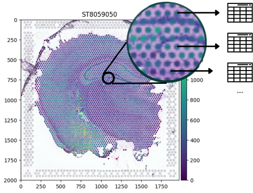
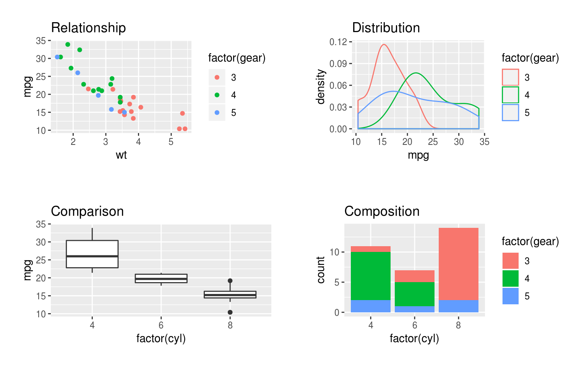

## 🧬 The REAL Scale of Transcriptomics

Modern cancer transcriptomics produces **massive, high-dimensional datasets**:

* **Bulk RNA-Seq:**
  * ~20,000 human genes quantified across patient cohorts.
  * Millions of sequencing reads per sample.

---

## 📊 Example: Bulk RNA-Seq Count Matrix

How raw transcriptomic data looks in a computational matrix

::: {style="font-size: 1.5em;"}
| Gene ID | Tumor_P1 | Tumor_P2 | Normal_P1 | Normal_P2 |
| :--- | :---: | :---: | :---: | :---: |
| **TP53** | 12,450 | 14,210 | 8,920 | 9,150 |
| **BRCA1** | 3,420 | 4,890 | 1,230 | 1,410 |
| **EGFR** | 45,820 | 38,100 | 5,420 | 6,100 |
| **GAPDH** | 102,400 | 98,350 | 95,800 | 99,200 |
| *(... 19,996 more)* | ... | ... | ... | ... |
:::

::: {.callout-note}
Notice how `GAPDH` (housekeeping) is steady across all samples, while oncogenes like `EGFR` are specifically amplified in Tumor samples!
:::

---

## 🧬 The REAL Scale of Transcriptomics

Modern cancer transcriptomics produces **massive, high-dimensional datasets**:

:::: {.columns}

::: {.column width="45%"}
* **Single-Cell & Spatial Transcriptomics:**
  * Measures expression across **thousands of individual cells** or **tissue spots**.
  * Count matrices easily exceed **MILLIONS** of data points per tumor biopsy.
:::

::: {.column width="55%"}
{fig-align="center" width="100%"}

::: {style="font-size: 0.5em; text-align: center; color: #888;"}
Source: [spatialdata.scverse.org](https://spatialdata.scverse.org/en/latest/tutorials/notebooks/notebooks/examples/technology_visium.html)
:::
:::

::::

---

## ⚠️ Why Excel isn't the tool?
### 1. Gene Date Corruption

* **Silent auto-conversion:**
  * `SEPT2` $\rightarrow$ **2-Sep**
  * `MARCH1` $\rightarrow$ **1-Mar**
* **>30% of published genomics papers** contained Excel date errors in supplementary files.
* Once saved, original gene identities are **PERMANANTLY** lost.

---

## ⚠️ Why Excel isn't the tool?
### 2. Hard Capacity Limits

* **1,048,576 rows** hard ceiling per sheet.
* Spatial & single-cell datasets profile 20,000+ genes $\times$ tens of thousands of spots/cells.
* Large matrices easily **crash** or silently **truncate** data.

---

## ⚠️ Why Excel isn't the tool?
### 3. Lack of Reproducibility

* **No audit trail:** Point-and-click edits leave no record.
* Impossible to trace cell filtering, modifications, or outlier removal.
* **Code is a protocol:** R scripts are version-controlled, automated, and 100% reproducible.

---

## 💡 Instead... We use R! (and Bioconductor) 

### 1. The Bioconductor Ecosystem

* **Purpose-built for genomics:** 2,000+ specialized, peer-reviewed packages.
* **Cancer & spatial standards:** Standardized data structures for bulk, single-cell, and spatial transcriptomics.

::: {style="display: flex; justify-content: center; align-items: center; gap: 20px; margin-top: 30px;"}
{width="145px"}
{width="145px"}
{width="145px"}
{width="145px"}
{width="145px"}
:::

---

## 💡 Instead... We use R! (and Bioconductor) 

### 2. 100% Reproducible Research

:::: {.columns}

::: {.column width="45%"}
* **Self-documenting workflows:**
  * Every normalization, filter, and cutoff is explicitly preserved in code.
* **Full audit trail:**
  * Anyone can re-run the script from raw data to reproduce the exact same results.
:::

::: {.column width="55%"}
{fig-align="center" width="100%"}
:::

::::

---

## 💡 Instead... We use R! (and Bioconductor) 

### 3. Publication-Grade Visualizations

:::: {.columns}

::: {.column width="45%"}
* **High-impact science communication:**
  * Powered by `ggplot2` and specialized spatial graphics engines.
* **Pixel-perfect control:**
  * Volcano plots, Heatmaps, and Spatial tissue overlays built directly for publication.
:::

::: {.column width="55%"}
{fig-align="center" width="100%"}

::: {style="font-size: 0.5em; text-align: center; color: #888;"}
Source: [benwhalley.github.io](https://benwhalley.github.io/just-enough-r/layered-graphics.html)
:::
:::

::::

---

## 📋 Table of Contents

:::: {.columns}

::: {.column width="50%"}
* **1. Syntax, Comments & Output**
* 2. Variables & The Assignment Operator (`<-`)
* 3. Core Data Types & Values
* 4. R Math Functions & Arithmetic Operators
:::

::: {.column width="50%"}
* 5. Strings & Escape Characters
* 6. R Operators
* 7. Control Flow (If...Else, Loops)
* 8. Practice Exercises
:::

::::

---

## 1. Syntax, Comments & Output
### Hello World! 🌏

In R, code executes sequentially from top to bottom.

```{webr-r}
# I am a comment! The interpreter DOES NOT see me.

print("Hello, Transcriptomics!")
```

::: {.callout-note}
`print()` wraps strings in quotes `""` and outputs a vector index `[1]`.
:::

---

## 1. Syntax, Comments & Output
### Let's do some math! 🔢

In R, bare expressions evaluate and print their result automatically.

```{webr-r}
5 + 3
```

::: {.callout-tip}
You do not need to wrap math inside `print()`.
:::

---

## 1. Syntax, Comments & Output
### Clean Output with `cat()` 😺

`cat()` combines text and numbers smoothly without surrounding quotes:

```{webr-r}
cat("Analysis started for sample:", "Visium_Tumor_01", "| Total spots:", 4992)
```

::: {.callout-note}
Notice how `cat()` strips quotation marks and vector index `[1]` for clean terminal messages!
:::

---

## 1. Syntax, Comments & Output
### Uh oh! ⁉️ Mistakes Happen... A LOT!


* If you miss a closing quote (`"`) or parenthesis (`)`), R **does not crash**.
* It waits on a new line showing a **`+` prompt**!

```{webr-r}
print("Hello, Transcriptomics!" # Notice the missing ')'
```

::: {.callout-important}
### 💡 How to Rescue Your Console
Press **`Escape`** or **`Ctrl + C`** to cancel and recover your prompt `>`!

**Golden Rule:** Quotes `""` and parentheses `()` must always match in pairs.
:::

---

## 1. Syntax, Comments & Output
### ✍️ Exercise 1.1: Spot Count Check

### Your Turn!
1. Write a comment with your name and today's date.
2. Print the message: `"Preprocessing..."`
3. Calculate the total spots on a slide using `cat()`: `"Total Spots:"` and `4992 + 1200`.

---

## 1. Syntax, Comments & Output
### ✍️ Exercise 1.1: Spot Count Check

### Solution:

```{webr-r}
print("Preprocessing...")

# Spatial array spots + extra border spots:
cat("Total Spots:", 4992 + 1200, "\n")
```

In 10x Visium, each standard capture area contains exactly **4,992** barcoded spots!

---

## 📋 Table of Contents

:::: {.columns}

::: {.column width="50%"}
* 1. Syntax, Comments & Output
* **2. Variables & The Assignment Operator (`<-`)**
* 3. Core Data Types & Values
* 4. R Math Functions & Arithmetic Operators
:::

::: {.column width="50%"}
* 5. Strings & Escape Characters
* 6. R Operators
* 7. Control Flow (If...Else, Loops)
* 8. Practice Exercises
:::

::::

---

## 2. Variables & The Assignment Operator (`<-`)
### Named Storage Containers in Memory

A **variable** is a named storage container in your computer's memory.
```{webr-r}
x <- 10
y <- 25

print(x)
print(y)

cat("Total =", x, "+", y, "=", x + y, "\n")
```

::: {.callout-note}
### 💡 Why not `=`?
While `=` works, R and Bioconductor standards strictly recommend **`<-`** for variable assignment, reserving `=` for passing arguments inside functions!
:::

---

## 2. Variables & The Assignment Operator (`<-`)
### Rules for Variable Names

:::: {.columns}

::: {.column width="50%"}
### ✅ DOs
* **Must start with a letter:**
* **Can contain:**
  * Letters, numbers, underscores (`_`), and periods (`.`)
* **Clean, descriptive names** make code readable for peers and reviewers!
:::

::: {.column width="50%"}
### 🛑 DON'Ts
* **Cannot start with a number:**
  * `1gene` causes a syntax error!
* **Cannot contain spaces:**
  * `cell count` is invalid!
* **R is strictly case-sensitive:**
  * `Gene_A`, `gene_A`, and `gene_a` are **3 completely different variables** in memory!
:::

::::

---

## 2. Variables & The Assignment Operator (`<-`)
### 🔍 Spot the Error!

```{webr-r}
project-id <- "V1"
```

---

## 2. Variables & The Assignment Operator (`<-`)
### 🔍 Spot the Error!

```{webr-r}
# FIX: Use an underscore '_' instead of a hyphen '-'
# Hyphens are subtraction: R tried to compute 'project - id'!
project_id <- "V1"

print(project_id)
```

::: {.callout-note}
### 💡 Why this works
R variable names cannot contain math operators like `-`. Use `snake_case` instead.
:::

---

## 2. Variables & The Assignment Operator (`<-`)
### 🔍 Spot the Error!

```{webr-r}
1st_sample <- "Visium_S1"
```

---

## 2. Variables & The Assignment Operator (`<-`)
### 🔍 Spot the Error!

```{webr-r}
# FIX: Start with a letter instead of a number
# Variable names in R cannot begin with a digit!
sample_1 <- "Visium_S1"

print(sample_1)
```

::: {.callout-note}
### 💡 Why this works
R requires variable names to begin with an alphabetic letter.
:::

---

## 2. Variables & The Assignment Operator (`<-`)
### 🔍 Spot the Error!

```{webr-r}
target_gene <- "EPCAM"

print(Target_gene)
```

---

## 2. Variables & The Assignment Operator (`<-`)
### 🔍 Spot the Error!

```{webr-r}
# FIX: Match the exact casing (R is case-sensitive!)
# We defined 'target_gene', so we must call 'target_gene' (not 'Target_gene')
target_gene <- "EPCAM"

print(target_gene)
```

::: {.callout-note}
### 💡 Why this works
`target_gene` and `Target_gene` refer to two completely different memory locations!
:::

---

## 2. Variables & The Assignment Operator (`<-`)

In standard bioinformatics and tidy R workflows, use **`snake_case`** (all lowercase words separated by underscores):

```{webr-r}
target_gene  <- "EPCAM"
sample_01_id <- "Visium_S1"

cat("Target gene:", target_gene, "| Sample:", sample_01_id, "\n")
```

::: {.callout-tip}
Using lowercase with underscores avoids accidental typos, prevents case-sensitivity errors, and keeps pipelines clean!
:::

---

## 2. Variables & The Assignment Operator (`<-`)
### ✍️ Exercise 1.2: Calculating Background Spots

### Your Turn!
1. A 10x Visium slide has `4992` total capture spots. Assign this number to a variable named `total_spots`.
2. Microscope imaging reveals that `3820` spots are covered by tissue. Assign this to `tissue_spots`.
3. Calculate the number of background (empty) spots and store it in `background_spots`.
4. Print the result using `cat()`: `"Background spots:"` and `background_spots`.

---

## 2. Variables & The Assignment Operator (`<-`)
### ✍️ Exercise 1.2: Calculating Background Spots

### Solution:

```{webr-r}
total_spots  <- 4992
tissue_spots <- 3820

# Calculate empty spots outside tissue boundary:
background_spots <- total_spots - tissue_spots

cat("Background spots:", background_spots, "\n")
```

::: {.callout-tip}
In spatial analysis, tissue spots capture cellular mRNA, while background spots are filtered out during quality control!
:::

---

## 📋 Table of Contents

:::: {.columns}

::: {.column width="50%"}
* 1. Syntax, Comments & Output
* 2. Variables & The Assignment Operator (`<-`)
* **3. Core Data Types & Values**
* 4. R Math Functions & Arithmetic Operators
:::

::: {.column width="50%"}
* 5. Strings & Escape Characters
* 6. R Operators
* 7. Control Flow (If...Else, Loops)
* 8. Practice Exercises
:::

::::

---

## 3. Core Data Types & Values

Every piece of data in R belongs to a specific atomic type:

| Type | What It Stores | Real Genomics Example |
| :--- | :--- | :--- |
| **`numeric`** | Decimals / Floats (default in R) | `log2_fc <- 2.45` |
| **`integer`** | Discrete counts / whole numbers (`L`) | `raw_reads <- 12450L` |
| **`character`** | Text strings (`""`) | `gene_name <- "TP53"` |
| **`logical`** | Boolean (`TRUE`/`FALSE`, no quotes!) | `is_de_gene <- TRUE` |

::: {.callout-note}
In R, numbers default to `numeric` (double). To explicitly store an integer (e.g., spot index or raw read count), append an `L` like `4992L`.
:::

---

## 3. Core Data Types & Values

Inspect any variable with `typeof()` or `class()`:

```{webr-r}
typeof(2.45)      # "double" (numeric)
typeof(12450L)    # "integer"
typeof("TP53")    # "character"
typeof(TRUE)      # "logical"
```

Combining different types forces everything to the most flexible type (character):
```{webr-r}
vector <- c(TRUE, 42, "TP53") # c() = "combine" 
class(vector)
```

---

## 3. Core Data Types & Values
### 🧬 Bioinformatics Pitfall: Type Coercion

Vectors can hold only **one** type! If you mix types, R silently coerces everything to the most flexible type (**character**):

```{webr-r}
# ❌ Accidental text string "NA" instead of missing value NA:
counts <- c(120, 450, "NA", 310)

# Mathematical calculations immediately fail:
sum(counts)
```

::: {.callout-caution}
### 💥 Why did `sum()` fail?
Because `"NA"` is text, R converted all numbers into character strings (`"120"`, `"450"`, `"310"`). R cannot perform math on strings!
:::

---

## 3. Core Data Types & Values
### ⚠️ Special Values: `NA` (Not Available)

* **`NA`** represents missing data, unmeasured spots, or biological dropouts.
* Extremely common in single-cell & spatial transcriptomics datasets.
* Test for missing values using **`is.na()`** (never `== NA`):

```{webr-r}
# Missing data / Sequencing dropout:
spot_read_count <- NA

# Check if value is missing:
is.na(spot_read_count)
```

::: {.callout-note}
### 💡 Gotcha: Never use `== NA`
`x == NA` returns `NA` because comparing anything to an unknown is unknown. Always use `is.na(x)`!
:::

---

## 3. Core Data Types & Values
### ⚠️ Special Values: `NaN` (Not a Number)

* **`NaN`** stands for **"Not a Number"**.
* Occurs when a mathematical operation is undefined or impossible (e.g., $0 / 0$).
* Test for undefined values using **`is.nan()`**:

```{webr-r}
# Undefined calculation:
zero_div_zero <- 0 / 0
print(zero_div_zero)

is.nan(zero_div_zero)
```

::: {.callout-tip}
In single-cell normalization, dividing a gene count of 0 by an empty spot's library size of 0 yields `NaN`.
:::

---

## 3. Core Data Types & Values
### ⚠️ Special Values: `Inf` & `-Inf` (Infinity)

* **`Inf`** and **`-Inf`** represent values exceeding numerical bounds.
* Arises when dividing non-zero numbers by zero, or taking the logarithm of zero ($\log(0)$).

```{webr-r}
# 1. Dividing non-zero by zero:
10 / 0   # Inf

# 2. Logarithm of zero:
log(0)   # -Inf
```

::: {.callout-important}
### 🧬 Transcriptomic Connection
Gene count matrices contain many zeros. Taking $\log_2(0) = -\infty$ crashes statistical pipelines — which is why we add a **pseudo-count** ($\log_2(\text{count} + 1)$)!
:::

---

## 📋 Table of Contents

:::: {.columns}

::: {.column width="50%"}
* 1. Syntax, Comments & Output
* 2. Variables & The Assignment Operator (`<-`)
* 3. Core Data Types & Values
* **4. R Math Functions & Arithmetic Operators**
:::

::: {.column width="50%"}
* 5. Strings & Escape Characters
* 6. R Operators
* 7. Control Flow (If...Else, Loops)
* 8. Practice Exercises
:::

::::

---

## 4. R Math Functions & Arithmetic Operators
### Standard Math Operators in Genomics

| Operator | Action | Real Genomics Example |
| :---: | :--- | :--- |
| `+` | Addition | `tot_reads <- 12000 + 3500` |
| `-` | Subtraction | `bg_spots <- 4992 - 3820` |
| `*` | Multiplication | `mito_pct <- 0.074 * 100` |
| `/` | Division | `depth_scale <- 45 / 15000` |
| `^` | Exponentiation | `fc <- 2^3` (8-fold change) |
| `%%` | Modulo (remainder) | `batch_rem <- 10 %% 3` (1) |
| `%/%` | Integer division | `cohort_grp <- 10 %/% 3` (3) |

::: {.callout-note}
In R, `%%` returns the remainder (e.g. testing for even/odd samples), while `%/%` performs integer division discarding fractions.
:::

---

## 4. R Math Functions & Arithmetic Operators

1. Square root:
```{webr-r}
sqrt(225)
```

2. Rounding numbers:
```{webr-r}
round(0.003412, 3)
floor(12.6)
ceiling(12.1)
```

---

## 4. R Math Functions & Arithmetic Operators

3. Logarithms (base 2 for fold change):
```{webr-r}
log2(8)
```

::: {.callout-tip}
In transcriptomics, $\log_2$ is standard because a 1-unit increase represents a **doubling (2-fold increase)** in gene expression!
:::

---

## 4. R Math Functions & Arithmetic Operators
### The Problem: Sequencing Depth Differences

```r
# Spot A (high sequencing depth):
spot_a_total_reads <- 50 * 10^6
spot_a_gene_reads  <- 450

# Spot B (lower sequencing depth):
spot_b_total_reads <- 10 * 10^6
spot_b_gene_reads  <- 200
```
* Spot A has 50M total reads
* Spot B has only 10M total reads.

Which gene is actually expressed at a **higher relative rate**?

---

## 4. R Math Functions & Arithmetic Operators
### The Solution: Counts Per Million (CPM)

$$\text{CPM} = \left( \frac{\text{Gene Read Count}}{\text{Total Library Size}} \right) \times 10^6$$

:::: {.columns}

::: {.column width="60%"}
```{webr-r}
spot_a_total_reads <- 50 * 10^6
spot_a_gene_reads  <- 450
spot_b_total_reads <- 10 * 10^6
spot_b_gene_reads  <- 200

# Calculate CPM:
cpm_a <- (spot_a_gene_reads / spot_a_total_reads) * 1e6
cpm_b <- (spot_b_gene_reads / spot_b_total_reads) * 1e6

cat("Spot A CPM:", cpm_a, "| Spot B CPM:", cpm_b, "\n")
cat("Spot B is", round(cpm_b / cpm_a, 1), "x higher!\n")
```
:::

::: {.column width="40%"}
::: {.callout-tip}
### 💡 The Normalization Takeaway
Raw counts deceive! Although Spot A has more reads (450 vs 200), Spot B actually expresses the gene at **2.2× higher rate** once normalized for sequencing depth.
:::
:::

::::

---

## 4. R Math Functions & Arithmetic Operators
### 💡 The $\log_2(0) = -\infty$ Trap & The `+ 1` Solution

:::: {.columns}

::: {.column width="50%"}
* **Why Log-Transform?**
  * Expression ranges from $0$ to $100,000+$. $\log_2$ scaling compresses extreme values into an interpretable scale.
* **The Catastrophic Trap:**
  $$\log_2(0) = -\infty$$
  * Most genes in a single cell or spot have **0 reads**. Passing $-\infty$ into downstream tools **crashes the analysis**!
:::

::: {.column width="50%"}
* **The Bioinformatic Fix: Pseudo-Counts (`+ 1`):**
  $$\log_2(0 + 1) = \log_2(1) = 0$$

```{webr-r}
raw_cpm <- 0

# ❌ Crashes statistical models:
log2(raw_cpm)      # -Inf

# ✅ Bioinformatic Standard:
log2(raw_cpm + 1)  # Exactly 0!
```
:::

::::

---

## 📋 Table of Contents

:::: {.columns}

::: {.column width="50%"}
* 1. Syntax, Comments & Output
* 2. Variables & The Assignment Operator (`<-`)
* 3. Core Data Types & Values
:::

::: {.column width="50%"}
* 4. Bio-Math & The Pseudo-Count
* **5. Workspace & Path Traps**
* 6. Hands-On Practice
:::

::::

---

## 5. Workspace & Path Traps
### 📁 "Where Am I?" — Managing Your Files

:::: {.columns}

::: {.column width="48%"}
* **`getwd()`:**
  * *"Where am I on my computer right now?"* Returns current working directory.
* **`list.files()` / `dir()`:**
  * *"What files are in this folder?"*
* **Protecting the Console with `head()`:**
  * Directories can contain thousands of files. `head()` previews the first 5 safely.
:::

::: {.column width="52%"}
```r
# 1. Check current directory path:
getwd()
# [1] "/home/mashxp/Spatial_Course"

# 2. Store all files in a variable:
all_files <- list.files()

# 3. Safely preview the first 5 files:
head(all_files, 5)
```
:::

::::

---

## 5. Workspace & Path Traps
### ⚠️ The Windows Backslash Escape Trap

:::: {.columns}

::: {.column width="50%"}
### ❌ The Windows Copy-Paste Error
* Windows copies file paths with backslashes: `"data\counts.csv"`
* In R, `\` is an **escape character** (like `\n` for newline).
* R tries to parse `\c` and immediately crashes:
  `Error: '\c' is an unrecognized escape!`
:::

::: {.column width="50%"}
### ✅ The Universal Solution
* **ALWAYS use forward slashes `/`** across Windows, Mac, and Linux:
```r
# ❌ FAILS on Windows path:
# path <- "data\visium\counts.csv"

# ✅ WORKS everywhere:
path <- "data/visium/counts.csv"

# Check if file exists:
file.exists(path)
```
:::

::::

---

## 📋 Table of Contents

:::: {.columns}

::: {.column width="50%"}
* 1. Syntax, Comments & Output
* 2. Variables & The Assignment Operator (`<-`)
* 3. Core Data Types & Values
:::

::: {.column width="50%"}
* 4. Bio-Math & The Pseudo-Count
* 5. Workspace & Path Traps
* **6. Hands-On Practice**
:::

::::

---

## 6. Hands-On Practice
### 🎯 Hands-On Coding Session!

::: {.callout-tip}
### Time to Code!
1. Open the companion practice notebook: **`01a1_R_Syntax_and_Variables.ipynb`**
2. Work through **Exercises 1.1 through 1.5** directly in Jupyter or Google Colab.
3. Treat your AI assistant as a 24/7 tutor to explain error messages and clarify code!
:::
