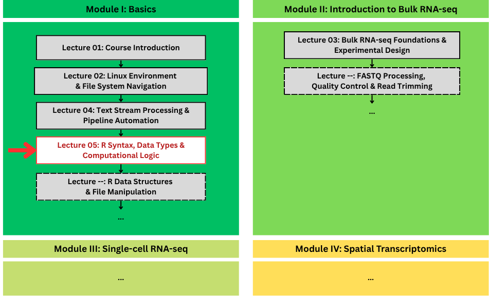
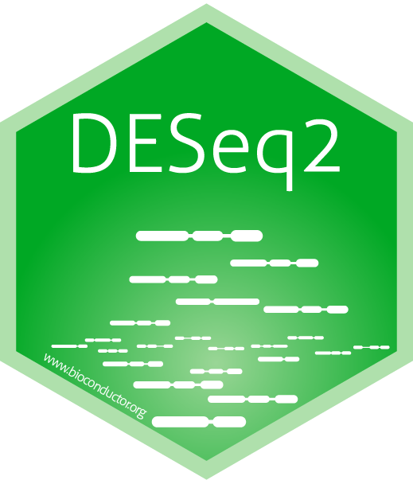
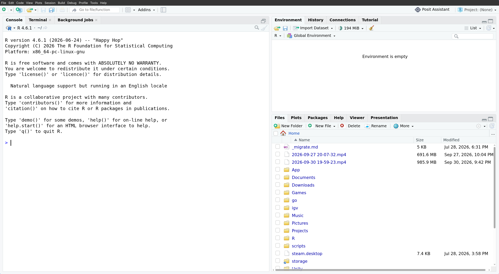

## 🗺️ Where We Are in the Course

{fig-align="center" width="88%"}

---

## Why R?

---

## 🧬 The REAL Scale of Transcriptomics

Modern cancer transcriptomics produces **massive, high-dimensional datasets**:

* **Bulk RNA-Seq:**
  * ~20,000 human genes quantified across patient cohorts.
  * Millions of sequencing reads per sample.

---

::: {.section-tag}
🧬 The REAL Scale of Transcriptomics
:::

### Example: Bulk RNA-Seq Count Matrix

How raw transcriptomic data looks in a computational matrix

::: {style="font-size: 1.5em;"}
| Gene ID | Tumor_P1 | Tumor_P2 | Normal_P1 | Normal_P2 |
| :--- | :---: | :---: | :---: | :---: |
| **TP53** | 12,450 | 14,210 | 8,920 | 9,150 |
| **BRCA1** | 3,420 | 4,890 | 1,230 | 1,410 |
| **EGFR** | 45,820 | 38,100 | 5,420 | 6,100 |
| **GAPDH** | 102,400 | 98,350 | 95,800 | 99,200 |
| *(... 19,996 more)* | ... | ... | ... | ... |
:::

::: {.callout-note}
Notice how `GAPDH` (housekeeping) is steady across all samples, while oncogenes like `EGFR` are specifically amplified in Tumor samples!
:::

---

::: {.section-tag}
🧬 The REAL Scale of Transcriptomics
:::

### Modern cancer transcriptomics

produces **massive, high-dimensional datasets**:

:::: {.columns}

::: {.column width="45%"}
* **Single-Cell & Spatial Transcriptomics:**
  * Measures expression across **thousands of individual cells** or **tissue spots**.
  * Count matrices easily exceed **MILLIONS** of data points per tumor biopsy.
:::

::: {.column width="55%"}
{fig-align="center" width="100%"}

::: {style="font-size: 0.5em; text-align: center; color: #888;"}
Source: [spatialdata.scverse.org](https://spatialdata.scverse.org/en/latest/tutorials/notebooks/notebooks/examples/technology_visium.html)
:::
:::

::::

---

## ⚠️ Why Excel isn't the tool?

---

::: {.section-tag}
⚠️ Why Excel isn't the tool?
:::

### 1. Gene Date Corruption

* **Silent auto-conversion:**
  * `SEPT2` $\rightarrow$ **2-Sep**
  * `MARCH1` $\rightarrow$ **1-Mar**
* **>30% of published genomics papers** contained Excel date errors in supplementary files.
* Once saved, original gene identities are **PERMANANTLY** lost.

---

::: {.section-tag}
⚠️ Why Excel isn't the tool?
:::
### 2. Hard Capacity Limits

* **1,048,576 rows** hard ceiling per sheet.
* Spatial & single-cell datasets profile 20,000+ genes $\times$ tens of thousands of spots/cells.
* Large matrices easily **crash** or silently **truncate** data.

---

::: {.section-tag}
⚠️ Why Excel isn't the tool?
:::
### 3. Lack of Reproducibility

* **No audit trail:** Point-and-click edits leave no record.
* Impossible to trace cell filtering, modifications, or outlier removal.
* **Code is a protocol:** R scripts are version-controlled, automated, and 100% reproducible.

---

## 💡 Instead... We use R! (and Bioconductor)

:::: {.columns}

::: {.column width="50%"}
{fig-align="center" width="210px"}
:::

::: {.column width="50%"}
{fig-align="center" width="185px"}
:::

::::

---

::: {.section-tag}
💡 Instead... We use R! (and Bioconductor)
:::

### 1. The Bioconductor Ecosystem

* **Purpose-built for genomics:** 2,000+ specialized, peer-reviewed packages.
* **Cancer & spatial standards:** Standardized data structures for bulk, single-cell, and spatial transcriptomics.

::: {style="display: flex; justify-content: center; align-items: center; gap: 20px; margin-top: 30px;"}
{width="145px"}
{width="145px"}
{width="145px"}
{width="145px"}
{width="145px"}
:::

---

::: {.section-tag}
💡 Instead... We use R! (and Bioconductor)
:::

### 2. 100% Reproducible Research

:::: {.columns}

::: {.column width="45%"}
* **Self-documenting workflows:**
  * Every normalization, filter, and cutoff is explicitly preserved in code.
* **Full audit trail:**
  * Anyone can re-run the script from raw data to reproduce the exact same results.
:::

::: {.column width="55%"}
{fig-align="center" width="100%"}
:::

::::

---

::: {.section-tag}
💡 Instead... We use R! (and Bioconductor)
:::

### 3. Publication-Grade Visualizations

:::: {.columns}

::: {.column width="45%"}
* **High-impact science communication:**
  * Powered by `ggplot2` and specialized spatial graphics engines.
* **Pixel-perfect control:**
  * Volcano plots, Heatmaps, and Spatial tissue overlays built directly for publication.
:::

::: {.column width="55%"}
{fig-align="center" width="100%"}

::: {style="font-size: 0.5em; text-align: center; color: #888;"}
Source: [benwhalley.github.io](https://benwhalley.github.io/just-enough-r/layered-graphics.html)
:::
:::

::::

---

## 🛠️ How to Install R?

---

::: {.section-tag}
🛠️ How to Install R?
:::

### 3 Ways to Get R Running

* **1. Local install** — R from **CRAN** + **RStudio Desktop** on your own machine
* **2. Google Colab** — R on Google's servers, nothing to install: [colab.to/r](https://colab.to/r)
* **3. Micromamba** — a reproducible `environment.yml` toolbox (our course standard)

::: {.callout-tip}
### 🎯 Pick one for today
Any of these allows you to run the exact same R. Start with the easiest, add the others when you need them.
:::

---

::: {.section-tag}
🛠️ How to Install R?
:::

### The Local Route: CRAN + RStudio

R is **free and open source**: install **R** (the engine that runs your code), then **RStudio** (the editor you work in).

:::: {.columns}

::: {.column width="48%"}
### Install R

* **CRAN for Linux**: [cloud.r-project.org/bin/linux](https://cloud.r-project.org/bin/linux) → pick your distro
* Debian/Ubuntu shortcut: `sudo apt install r-base r-base-dev`

Check what you actually got:

```{webr-r}
R.version.string
```
:::

::: {.column width="48%"}
### Install RStudio

* **Posit**: [posit.co/download/rstudio-desktop](https://posit.co/download/rstudio-desktop/) — `.deb` for Debian/Ubuntu, `.rpm` for Fedora
* Auto-detects your R on launch

::: {.callout-note}
### 🧩 Engine vs. Editor
R is the language; RStudio is the cockpit. Keep `Rscript` for cluster pipelines.
:::
:::

::::

---

::: {.section-tag}
🛠️ How to Install R?
:::

### RStudio IDE

{fig-align="center"}

::: {.callout-tip}
### 🧭 Never lose your work
An unsaved script is lost forever — use `File → Save` (`Ctrl/Cmd + S`) after every edit.
:::

---

::: {.section-tag}
🛠️ How to Install R?
:::

### VS Code Works Too!

:::: {.columns}

::: {.column width="48%"}
#### Install on Ubuntu

```bash
# Easiest — snap:
sudo snap install code --classic

# Or grab the .deb from code.visualstudio.com, then:
sudo apt install ./code_*.deb
```

* Extensions (`Ctrl/Cmd + Shift + X`) → **R Extension** by *REditorSupport*: REPL, highlighting, debugger, plot pane.
  * Or from the terminal: `code --install-extension REditorSupport.r`
:::

::: {.column width="48%"}
#### Point It at Your R

* `R: Select R interpreter` → choose your R
* Type in the **R Terminal**, `Ctrl + Enter` runs the line — just like RStudio's console.
* Shell: `code analysis.R` · headless: `Rscript analysis.R`
:::
::::

::: {.callout-tip}
### 🤝 Either Editor Is Fine
RStudio is all-in-one; VS Code wins when you work across languages. Both run the exact same R.
:::

---

::: {.section-tag}
🛠️ How to Install R?
:::

### R in Google Colab - Skip Installation Entirely!

[Google Colab](https://colab.research.google.com) runs **R on Google's servers in your browser** — nothing to install, and the notebook lives in your Drive.

* Open an R notebook at **[colab.to/r](https://colab.to/r)**, or set `Runtime → Change runtime type → R`
* Type code in a **code cell**, then press **`Ctrl + Enter`** (`Cmd + Enter` on Mac)
* Missing a package? Install it once, then load it:

```r
# 1. Install (once per session)
install.packages("ggplot2")

# 2. Load it so your code can use it
library(ggplot2)
```

::: {.callout-important}
### ⚠️ Colab Is Not Persistent
Colab runs on a temporary server — when the session disconnects or goes idle it is wiped clean, and every installed package and uploaded file disappears. Save anything you want to keep to your Drive before you close the tab.
:::

---

## 📋 1. Syntax, Comments & Output

:::: {.columns}

::: {.column width="50%"}
* **1. Syntax, Comments & Output**
* 2. Variables & The Assignment Operator (`<-`)
* 3. Core Data Types & Values
* 4. R Math Functions & Arithmetic Operators
:::

::: {.column width="50%"}
* 5. Strings & Escape Characters
* 6. R Operators
* 7. Control Flow (If...Else, Loops)
* 8. Practice Exercises
:::

::::

---

::: {.section-tag}
1. Syntax, Comments & Output
:::
### Hello World! 🌏

In R, code executes sequentially from top to bottom.

```{webr-r}
# I am a comment! The interpreter DOES NOT see me.

print("Hello, Transcriptomics!")
```

::: {.callout-note}
`print()` wraps strings in quotes `""` and outputs a vector index `[1]`.
:::

---

::: {.section-tag}
1. Syntax, Comments & Output
:::
### Let's do some math! 🔢

In R, bare expressions evaluate and print their result automatically.

```{webr-r}
5 + 3
```

::: {.callout-tip}
You do not need to wrap math inside `print()`.
:::

---

::: {.section-tag}
1. Syntax, Comments & Output
:::
### Displaying Values with `print()` 🖨️

Use `print()` to display text messages and numeric values to the console:

```{webr-r}
print("Processing dataset: 10x Genomics Visium Human Breast Cancer")

print(4992)
```

::: {.callout-note}
Notice that `print()` outputs `[1]` before the value. This indicates that the output is a vector whose first element starts at index 1!
:::

---

::: {.section-tag}
1. Syntax, Comments & Output
:::
### Uh oh! ⁉️ Mistakes Happen... A LOT!


* If you miss a closing quote (`"`) or parenthesis (`)`), R **does not crash**.
* It waits on a new line showing a **`+` prompt**!

```{webr-r}
print("Hello, Transcriptomics!" # Notice the missing ')'
```

::: {.callout-important}
### 💡 How to Rescue Your Console
Press **`Escape`** or **`Ctrl + C`** to cancel and recover your prompt `>`!

**Golden Rule:** Quotes `""` and parentheses `()` must always match in pairs.
:::

---

::: {.section-tag}
1. Syntax, Comments & Output
:::
### ✍️ Exercise 1.1: Spot Count Check

::: {.slide-kicker}
Your Turn!
:::
1. Write a comment with your name and today's date.
2. Print the message: `"Preprocessing..."`
3. Calculate the total spots on a slide by adding `4992 + 1200` using `print()`.

---

::: {.section-tag}
1. Syntax, Comments & Output
:::
### ✅ Exercise 1.1: Spot Count Check

::: {.slide-kicker}
Solution:
:::

```{webr-r}
print("Preprocessing...")

# Spatial array spots + extra border spots:
print(4992 + 1200)
```

In 10x Visium, each standard capture area contains exactly **4,992** barcoded spots!

---

## 📋 2. Variables & The Assignment Operator (`<-`)

:::: {.columns}

::: {.column width="50%"}
* 1. Syntax, Comments & Output
* **2. Variables & The Assignment Operator (`<-`)**
* 3. Core Data Types & Values
* 4. R Math Functions & Arithmetic Operators
:::

::: {.column width="50%"}
* 5. Strings & Escape Characters
* 6. R Operators
* 7. Control Flow (If...Else, Loops)
* 8. Practice Exercises
:::

::::

---

::: {.section-tag}
2. Variables & The Assignment Operator (&lt;-)
:::
### Named Storage Containers in Memory

A **variable** is a named storage container in your computer's memory.
```{webr-r}
x <- 10
y <- 25

print(x)
print(y)

# Print the evaluated sum:
print(x + y)
```

::: {.callout-note}
### 💡 Why not `=`?
While `=` works, R and Bioconductor standards strictly recommend **`<-`** for variable assignment, reserving `=` for passing arguments inside functions!
:::

---

::: {.section-tag}
2. Variables & The Assignment Operator (&lt;-)
:::
### Rules for Variable Names

:::: {.columns}

::: {.column width="50%"}
### ✅ DOs
* **Must start with a letter:**
* **Can contain:**
  * Letters, numbers, underscores (`_`), and periods (`.`)
* **Clean, descriptive names** make code readable for peers and reviewers!
:::

::: {.column width="50%"}
### 🛑 DON'Ts
* **Cannot start with a number:**
  * `1gene` causes a syntax error!
* **Cannot contain spaces:**
  * `cell count` is invalid!
* **R is strictly case-sensitive:**
  * `Gene_A`, `gene_A`, and `gene_a` are **3 completely different variables** in memory!
:::

::::

---

::: {.section-tag}
2. Variables & The Assignment Operator (&lt;-)
:::
### 🔍 Spot the Error!

```{webr-r}
project-id <- "V1"
```

---

::: {.section-tag}
2. Variables & The Assignment Operator (&lt;-)
:::
### ✅ Solution: Hyphens in names

```{webr-r}
# FIX: Use an underscore '_' instead of a hyphen '-'
# Hyphens are subtraction: R tried to compute 'project - id'!
project_id <- "V1"

print(project_id)
```

::: {.callout-note}
### 💡 Why underscores work
R variable names cannot contain math operators like `-`. Use `snake_case` instead.
:::

---

::: {.section-tag}
2. Variables & The Assignment Operator (&lt;-)
:::
### 🔍 Spot the Error!

```{webr-r}
1st_sample <- "Visium_S1"
```

---

::: {.section-tag}
2. Variables & The Assignment Operator (&lt;-)
:::
### ✅ Solution: Leading digits

```{webr-r}
# FIX: Start with a letter instead of a number
# Variable names in R cannot begin with a digit!
sample_1 <- "Visium_S1"

print(sample_1)
```

::: {.callout-note}
### 💡 Why names must start with a letter
R requires variable names to begin with an alphabetic letter.
:::

---

::: {.section-tag}
2. Variables & The Assignment Operator (&lt;-)
:::
### 🔍 Spot the Error!
```{webr-r}
target_gene <- "EPCAM"

print(Target_gene)
```

---

::: {.section-tag}
2. Variables & The Assignment Operator (&lt;-)
:::
### ✅ Solution: Variables are Case-sensitive

```{webr-r}
# FIX: Match the exact casing (R is case-sensitive!)
# We defined 'target_gene', so we must call 'target_gene' (not 'Target_gene')
target_gene <- "EPCAM"

print(target_gene)
```

::: {.callout-note}
### 💡 Why casing matters
`target_gene` and `Target_gene` refer to two completely different memory locations!
:::

---

::: {.section-tag}
2. Variables & The Assignment Operator (&lt;-)
:::
### Use `snake_case` for Readability

In standard bioinformatics and tidy R workflows, use **`snake_case`** (all lowercase words separated by underscores):

```{webr-r}
target_gene  <- "EPCAM"
sample_01_id <- "Visium_S1"

print(target_gene)
print(sample_01_id)
```

::: {.callout-tip}
Using lowercase with underscores avoids accidental typos, prevents case-sensitivity errors, and keeps pipelines clean!
:::

---

::: {.section-tag}
2. Variables & The Assignment Operator (&lt;-)
:::
### ✍️ Exercise 1.2: Calculating Background Spots

::: {.slide-kicker}
Your Turn!
:::
1. A 10x Visium slide has `4992` total capture spots. Assign this number to a variable named `total_spots`.
2. Microscope imaging reveals that `3820` spots are covered by tissue. Assign this to `tissue_spots`.
3. Calculate the number of background (empty) spots and store it in `background_spots`.
4. Print the result using `print(background_spots)`.

---

::: {.section-tag}
2. Variables & The Assignment Operator (&lt;-)
:::
### ✅ Exercise 1.2: Calculating Background Spots

::: {.slide-kicker}
Solution:
:::

```{webr-r}
total_spots  <- 4992
tissue_spots <- 3820

# Calculate empty spots outside tissue boundary:
background_spots <- total_spots - tissue_spots

print(background_spots)
```

::: {.callout-tip}
In spatial analysis, tissue spots capture cellular mRNA, while background spots are filtered out during quality control!
:::

---

## 📋 3. Core Data Types & Values

:::: {.columns}

::: {.column width="50%"}
* 1. Syntax, Comments & Output
* 2. Variables & The Assignment Operator (`<-`)
* **3. Core Data Types & Values**
* 4. R Math Functions & Arithmetic Operators
:::

::: {.column width="50%"}
* 5. Strings & Escape Characters
* 6. R Operators
* 7. Control Flow (If...Else, Loops)
* 8. Practice Exercises
:::

::::

---

::: {.section-tag}
3. Core Data Types & Values
:::

Every piece of data in R belongs to a specific atomic type:

| Type | What It Stores | Real Genomics Example |
| :--- | :--- | :--- |
| **`numeric`** | Decimals / Floats (default in R) | `log2_fc <- 2.45` |
| **`integer`** | Discrete counts / whole numbers (`L`) | `raw_reads <- 12450L` |
| **`character`** | Text strings (`""`) | `gene_name <- "TP53"` |
| **`logical`** | Boolean (`TRUE`/`FALSE`, no quotes!) | `is_de_gene <- TRUE` |

::: {.callout-note}
In R, numbers default to `numeric` (double). To explicitly store an integer (e.g., spot index or raw read count), append an `L` like `4992L`.
:::

---

::: {.section-tag}
3. Core Data Types & Values
:::

Inspect any variable with `typeof()` or `class()`:

```{webr-r}
typeof(2.45)      # "double" (numeric)
typeof(12450L)    # "integer"
typeof("TP53")    # "character"
typeof(TRUE)      # "logical"
```

Combining different types forces everything to the most flexible type (character):
```{webr-r}
vector <- c(TRUE, 42, "TP53") # c() = "combine" 
class(vector)
```

---

::: {.section-tag}
3. Core Data Types & Values
:::
### 🧬 Bioinformatics Pitfall: Type Coercion

Vectors can hold only **one** type! If you mix types, R silently coerces everything to the most flexible type (**character**):

```{webr-r}
# ❌ Accidental text string "NA" instead of missing value NA:
counts <- c(120, 450, "NA", 310)

# Mathematical calculations immediately fail:
sum(counts)
```

::: {.callout-caution}
### 💥 Why did `sum()` fail?
Because `"NA"` is text, R converted all numbers into character strings (`"120"`, `"450"`, `"310"`). R cannot perform math on strings!
:::

---

::: {.section-tag}
3. Core Data Types & Values
:::
### ⚠️ Special Values: `NA` (Not Available)

* **`NA`** represents missing data, unmeasured spots, or biological dropouts.
* Extremely common in single-cell & spatial transcriptomics datasets.
* Test for missing values using **`is.na()`** (never `== NA`):

```{webr-r}
# Missing data / Sequencing dropout:
spot_read_count <- NA

# Check if value is missing:
is.na(spot_read_count)
```

::: {.callout-note}
### 💡 Gotcha: Never use `== NA`
`x == NA` returns `NA` because comparing anything to an unknown is unknown. Always use `is.na(x)`!
:::

---

::: {.section-tag}
3. Core Data Types & Values
:::
### ⚠️ Special Values: `NaN` (Not a Number)

* **`NaN`** stands for **"Not a Number"**.
* Occurs when a mathematical operation is undefined or impossible (e.g., $0 / 0$).
* Test for undefined values using **`is.nan()`**:

```{webr-r}
# Undefined calculation:
zero_div_zero <- 0 / 0
print(zero_div_zero)

is.nan(zero_div_zero)
```

::: {.callout-tip}
In single-cell normalization, dividing a gene count of 0 by an empty spot's library size of 0 yields `NaN`.
:::

---

::: {.section-tag}
3. Core Data Types & Values
:::
### ⚠️ Special Values: `Inf` & `-Inf` (Infinity)

* **`Inf`** and **`-Inf`** represent values exceeding numerical bounds.
* Arises when dividing non-zero numbers by zero, or taking the logarithm of zero ($\log(0)$).

```{webr-r}
# 1. Dividing non-zero by zero:
10 / 0   # Inf

# 2. Logarithm of zero:
log(0)   # -Inf
```

::: {.callout-important}
### 🧬 Transcriptomic Connection
Gene count matrices contain many zeros. Taking $\log_2(0) = -\infty$ crashes statistical pipelines — which is why we add a **pseudo-count** ($\log_2(\text{count} + 1)$)!
:::

---

## 📋 4. R Math Functions & Arithmetic Operators

:::: {.columns}

::: {.column width="50%"}
* 1. Syntax, Comments & Output
* 2. Variables & The Assignment Operator (`<-`)
* 3. Core Data Types & Values
* **4. R Math Functions & Arithmetic Operators**
:::

::: {.column width="50%"}
* 5. Strings & Escape Characters
* 6. R Operators
* 7. Control Flow (If...Else, Loops)
* 8. Practice Exercises
:::

::::

---

::: {.section-tag}
4. R Math Functions & Arithmetic Operators
:::
### Standard Math Operators in Genomics

| Operator | Action | Real Genomics Example |
| :---: | :--- | :--- |
| `+` | Addition | `tot_reads <- 12000 + 3500` |
| `-` | Subtraction | `bg_spots <- 4992 - 3820` |
| `*` | Multiplication | `mito_pct <- 0.074 * 100` |
| `/` | Division | `depth_scale <- 45 / 15000` |
| `^` | Exponentiation | `fc <- 2^3` (8-fold change) |
| `%%` | Modulo (remainder) | `batch_rem <- 10 %% 3` (1) |
| `%/%` | Floor division | `cohort_grp <- 10 %/% 3` (3) |

::: {.callout-note}
In R, `%%` returns the remainder (e.g. testing for even/odd samples), while `%/%` performs floor division, discarding the fractional part.
:::

---

::: {.section-tag}
4. R Math Functions & Arithmetic Operators
:::

1. Square root:
```{webr-r}
sqrt(225)
```

2. Rounding numbers:
```{webr-r}
round(0.003412, 3)
floor(12.6)
ceiling(12.1)
```

---

::: {.section-tag}
4. R Math Functions & Arithmetic Operators
:::

3. Logarithms (base 2 for fold change):
```{webr-r}
log2(8)
```

::: {.callout-tip}
In transcriptomics, $\log_2$ is standard because a 1-unit increase represents a **doubling (2-fold increase)** in gene expression!
:::

---

::: {.section-tag}
4. R Math Functions & Arithmetic Operators
:::
### The Problem: Sequencing Depth Differences

```r
# Spot A (high sequencing depth):
spot_a_total_reads <- 50 * 10^6
spot_a_gene_reads  <- 450

# Spot B (lower sequencing depth):
spot_b_total_reads <- 10 * 10^6
spot_b_gene_reads  <- 200
```
* Spot A has 50M total reads
* Spot B has only 10M total reads.

Which gene is actually expressed at a **higher relative rate**?

---

::: {.section-tag}
4. R Math Functions & Arithmetic Operators
:::
### The Solution: Counts Per Million (CPM)

$$\text{CPM} = \left( \frac{\text{Gene Read Count}}{\text{Total Library Size}} \right) \times 10^6$$

:::: {.columns}

::: {.column width="60%"}
```{webr-r}
spot_a_total_reads <- 50 * 10^6
spot_a_gene_reads  <- 450
spot_b_total_reads <- 10 * 10^6
spot_b_gene_reads  <- 200

# Calculate CPM:
cpm_a <- (spot_a_gene_reads / spot_a_total_reads) * 1e6
cpm_b <- (spot_b_gene_reads / spot_b_total_reads) * 1e6

cpm_results <- c(Spot_A = cpm_a, Spot_B = cpm_b)
print(cpm_results)
```
:::

::: {.column width="40%"}
::: {.callout-tip}
### The Normalization Takeaway
Raw counts deceive!

Although Spot A has more reads (450 vs 200), Spot B actually expresses the gene at **2.2× higher rate** once normalized for sequencing depth.
:::
:::

::::

---

## 📋 5. Strings & Escape Characters

:::: {.columns}

::: {.column width="50%"}
* 1. Syntax, Comments & Output
* 2. Variables & The Assignment Operator (`<-`)
* 3. Core Data Types & Values
* 4. R Math Functions & Arithmetic Operators
:::

::: {.column width="50%"}
* **5. Strings & Escape Characters**
* 6. R Operators
* 7. Control Flow (If...Else, Loops)
* 8. Practice Exercises
:::

::::

---

::: {.section-tag}
5. Strings & Escape Characters
:::
### Single vs. Double Quotes

A **string** stores text data. In R, strings can be created using matching double (`"`) or single (`'`) quotes:

:::: {.columns}

::: {.column width="50%"}
* **Both Are Valid:**
  * R treats `'text'` and `"text"` identically in memory.
* **Bioinformatics Standard:**
  * Double quotes `"` are strongly preferred across Bioconductor and Tidyverse codebases.
:::

::: {.column width="50%"}
```{webr-r}
# 1. Standard double-quoted string:
gene_name <- "EPCAM"

# 2. Single-quoted string:
sample_id <- 'Tumor_Spot_01'

print(gene_name)
print(sample_id)
```

::: {.callout-warning}
### Golden Rule
Never mix opening and closing types (e.g., `"text'` will throw a syntax error)!
:::
:::

::::

---

::: {.section-tag}
5. Strings & Escape Characters
:::
### Quotes Inside Quotes

What happens when your text itself contains quotation marks or apostrophes?

:::: {.columns}

::: {.column width="50%"}
* **Enclose with the Opposite Type:**
  * Put **double quotes** inside **single quotes**:
    `'Expression: "High"'`
  * Put **single quotes (apostrophes)** inside **double quotes**:
    `"Patient's sample"`
:::

::: {.column width="50%"}
```{webr-r}
# Double quotes inside single quotes:
annotation <- 'Annotation: "Epithelial Marker"'
print(annotation)

# Apostrophe inside double quotes:
sample_desc <- "Patient's sample"
print(sample_desc)
```

::: {.callout-note}
### Why this matters?
If you don't use the opposite quote type, R gets confused about where the string ends!
:::
:::

::::

---

::: {.section-tag}
5. Strings & Escape Characters
:::
### Concatenations! 😺

To print clean sentences and combine text smoothly with variables, R provides **`cat()`** (short for con-**cat**-enate):

:::: {.columns}

::: {.column width="50%"}
* **Why use `cat()`?**
  * `print()` wraps text in quotes and adds vector indices (`[1]`).
  * `cat()` combines multiple pieces into readable terminal sentences!
* **The Trailing `"\n"` Rule:**
  * Unlike `print()`, `cat()` does not add a newline automatically. Always end with `"\n"` to advance to the next line.
:::

::: {.column width="50%"}
```{webr-r}
gene_name <- "BRCA1"
spot_count <- 3820

# Combining text and numbers cleanly:
cat("Processing gene:", gene_name, "| Total spots:", spot_count, "\n")
```

::: {.callout-note}
Notice that `"\n"` at the end? That is an **escape character**! Let's explore what backslashes do next!
:::
:::

::::

---

::: {.section-tag}
5. Strings & Escape Characters
:::
### Escape Characters (`\n`, `\t`, `\"`)

The backslash **`\`** is a special signal in R that modifies the character following it:

:::: {.columns}

::: {.column width="50%"}
| Escape Code | Meaning | What It Does |
| :---: | :--- | :--- |
| `\n` | New Line | Jumps down to a fresh line |
| `\t` | Tab Space | Inserts a clean column indent |
| `\"` | Double Quote | Puts literal `"` inside `"..."` |

::: {.callout-warning}
### `\` is Special in R!
The backslash tells R: *"Don't treat the next character literally; it is an escape command!"*
:::
:::

::: {.column width="50%"}
```{webr-r}
# 1. Newline and Tab spacing with cat():
cat("Sample:\tTumor_01\nStatus:\tExpressed\n")

# 2. Including double quotes inside double quotes:
quote_text <- "The gene was named \"GAPDH\" by scientists."
cat(quote_text, "\n")
```

::: {.callout-tip}
Because `cat()` interprets escape sequences, `\"` renders as real quotes on screen!
:::
:::

::::

---

::: {.section-tag}
5. Strings & Escape Characters
:::
### 🔍 Trivia

:::: {.columns}

::: {.column width="50%"}
* A researcher on Windows copies a path from File Explorer:
  `"data\visium\counts.csv"`
:::

::: {.column width="50%"}
```{webr-r}
count_file <- "data\visium\counts.csv"
print(count_file)
```
:::

::::

---

::: {.section-tag}
5. Strings & Escape Characters
:::
### 🔍 The Windows Path Trap — Solution

:::: {.columns}

::: {.column width="50%"}
* Because `\` is the **escape character**, R tried to parse `\v` and `\c` as escape codes!
* Since `\c` is not a valid escape sequence (like `\n` or `\t`), R crashed.

:::

::: {.column width="50%"}
```{webr-r}
# FIX: Always use forward slashes '/' in R paths!
# Forward slashes work reliably on Windows, Mac, and Linux:
count_file <- "data/visium/counts.csv"

cat("Loading matrix from:", count_file, "\n")
```

::: {.callout-tip}
### 🌐 The Universal Rule
**ALWAYS use forward slashes `/`** in R paths across Windows, macOS, and Linux!
:::

:::

::::

---

## 📋 6. R Operators

:::: {.columns}

::: {.column width="50%"}
* 1. Syntax, Comments & Output
* 2. Variables & The Assignment Operator (`<-`)
* 3. Core Data Types & Values
* 4. R Math Functions & Arithmetic Operators
:::

::: {.column width="50%"}
* 5. Strings & Escape Characters
* **6. R Operators**
* 7. Control Flow (If...Else, Loops)
* 8. Practice Exercises
:::

::::

---

::: {.section-tag}
6. R Operators
:::
### Comparison Operators

Comparison operators test relationships between values. The result is always a **`logical`** (`TRUE` or `FALSE`).

:::: {.columns}

::: {.column width="50%"}

| Operator | Meaning | Example |
|:---:|:---|:---|
| `==` | Exactly equal to | `x == 10` |
| `!=` | Not equal to | `x != 10` |
| `>` | Greater than | `x > 5` |
| `<` | Less than | `x < 5` |
| `>=` | Greater than or equal to | `x >= 10` |
| `<=` | Less than or equal to | `x <= 10` |

:::

::: {.column width="50%"}

```{webr-r}
# 1. Numeric comparisons:
umi_count <- 1250
umi_count >= 1000
```

```{webr-r}
# 2. String comparisons:
spot_region <- "Tumor"
spot_region != "Stroma"
```

:::

::::

---

::: {.section-tag}
6. R Operators
:::
### Logical AND (`&`)

Returns `TRUE` **only if both** conditions are `TRUE`.

:::: {.columns}

::: {.column width="50%"}
* Evaluates left and right conditions.
* If either side is `FALSE`, the entire result is `FALSE`.

| Left | Right | `Left & Right` |
|:---:|:---:|:---:|
| `TRUE` | `TRUE` | **`TRUE`** |
| `TRUE` | `FALSE` | `FALSE` |
| `FALSE` | `TRUE` | `FALSE` |
| `FALSE` | `FALSE` | `FALSE` |


:::

::: {.column width="50%"}

```{webr-r}
reads <- 1500
mito_pct <- 8.2

# Spot must meet BOTH thresholds:
pass_qc <- (reads >= 500) & (mito_pct < 15.0)

cat("Passes standard QC:", pass_qc, "\n")
```


::: {.callout-note}
### Precedence Tip
Use parentheses `(...)` around each comparison to keep compound logic clear.
:::

:::

::::

---

::: {.section-tag}
6. R Operators
:::
### Logical OR (`|`)

Returns `TRUE` if **at least one** condition is `TRUE`.

:::: {.columns}

::: {.column width="50%"}
* Evaluates left and right conditions.
* Returns `FALSE` **only if both** sides are `FALSE`.

| Left | Right | `Left | Right` |
|:---:|:---:|:---:|
| `TRUE` | `TRUE` | `TRUE` |
| `TRUE` | `FALSE` | `TRUE` |
| `FALSE` | `TRUE` | `TRUE` |
| `FALSE` | `FALSE` | **`FALSE`** |

:::

::: {.column width="50%"}

```{webr-r}
reads <- 150
mito_pct <- 8.2

# Flag spot if reads are too low OR mito is too high:
flag_spot <- (reads < 200) | (mito_pct > 25.0)

cat("Flagged for review:", flag_spot, "\n")
```

:::

::::

---

::: {.section-tag}
6. R Operators
:::
### Logical NOT (`!`)

Inverts any truth value (`TRUE` $\rightarrow$ `FALSE`, `FALSE` $\rightarrow$ `TRUE`).

:::: {.columns}

::: {.column width="50%"}
* Reverses a logical condition.
* Useful to negate flags or keep unflagged samples.

| Input | `!Input` |
|:---:|:---:|
| `TRUE` | **`FALSE`** |
| `FALSE` | **`TRUE`** |

:::

::: {.column width="50%"}

```{webr-r}
flag_spot <- TRUE

# Invert flag to check if spot is valid:
is_valid <- !flag_spot

cat("Flagged:", flag_spot, "\n")
cat("Valid for analysis:", is_valid, "\n")
```

:::

::::

---

::: {.section-tag}
6. R Operators
:::
### 🔍 Practice: Spot Quality Filter

:::: {.columns}

::: {.column width="50%"}

A spatial spot has been sequenced with these metrics:

Write a compound logical expression for `keep_spot`. It should evaluate to `TRUE` **only if all 3** conditions pass:

1. `on_tissue` is `TRUE`
2. `gene_count` is at least `500` AND at most `2500`
3. `mito_pct` is less than `20.0`

:::

::: {.column width="50%"}

```{webr-r}
gene_count <- 1850
mito_pct <- 22.4
on_tissue <- TRUE

# Complete the expression:
keep_spot <- ...

cat("Retain spot for clustering?", keep_spot, "\n")
```

:::

::::

---

::: {.section-tag}
6. R Operators
:::
### ✅ Solution — Spot Quality Filter

:::: {.columns}

::: {.column width="50%"}
* Condition 1: `on_tissue == TRUE` (or simply `on_tissue`) $\rightarrow$ `TRUE`
* Condition 2: `(gene_count >= 500) & (gene_count <= 2500)` $\rightarrow$ `TRUE`
* Condition 3: `mito_pct < 20.0` $\rightarrow$ `FALSE` (`22.4 < 20` is false)

Overall: `TRUE & TRUE & FALSE` $\rightarrow$ **`FALSE`** (spot is filtered out).

:::

::: {.column width="50%"}

```{webr-r}
gene_count <- 1850
mito_pct <- 22.4
on_tissue <- TRUE

keep_spot <- on_tissue & 
             (gene_count >= 500) & 
             (gene_count <= 2500) & 
             (mito_pct < 20.0)

cat("Retain spot for clustering?", keep_spot, "\n")
```

::: {.callout-tip}
### Chaining Range Checks
In R, you cannot write `500 <= gene_count <= 2500`. You must write two separate comparisons joined by `&`: `(gene_count >= 500) & (gene_count <= 2500)`.
:::

:::

::::

---

## 📋 7. Control Flow (If...Else, Loops)

:::: {.columns}

::: {.column width="50%"}
* 1. Syntax, Comments & Output
* 2. Variables & The Assignment Operator (`<-`)
* 3. Core Data Types & Values
* 4. R Math Functions & Arithmetic Operators
:::

::: {.column width="50%"}
* 5. Strings & Escape Characters
* 6. R Operators
* **7. Control Flow (If...Else, Loops)**
* 8. Practice Exercises
:::

::::

---

::: {.section-tag}
7. Control Flow (If...Else, Loops)
:::
### Conditional Branching (`if...else`)

:::: {.columns}

::: {.column width="50%"}
* **`if`**: Runs code block only if condition is `TRUE`.
* **`else`**: Catch-all fallback if condition is `FALSE`.

::: {.callout-note}
### R Syntax Requirement
`else` must always be on the **same line** as the closing brace `}`: `} else {`
:::

:::

::: {.column width="50%"}

```{webr-r}
reads <- 850

if (reads >= 500) {
  cat("Spot status: PASS\n")
} else {
  cat("Spot status: FAIL\n")
}
```

:::

::::

---

::: {.section-tag}
7. Control Flow (If...Else, Loops)
:::

:::: {.columns}

::: {.column width="50%"}
**What if you need more conditions?**

* Use `else if` to test additional checks in order.
* R runs the **first** branch that is `TRUE`, then stops.
* `else` catches whatever is left over.

:::

::: {.column width="50%"}

```{webr-r}
expression_val <- 450

if (expression_val > 500) {
  cat("Tier: High Expression\n")
} else if (expression_val >= 100) {
  cat("Tier: Medium Expression\n")
} else {
  cat("Tier: Low Expression\n")
}
```

:::

::::

---

::: {.section-tag}
7. Control Flow (If...Else, Loops)
:::
### `for` Loops (Iterating Vectors)

A `for` loop executes a block of code once for each element in a vector:

:::: {.columns}

::: {.column width="50%"}
* Iterates sequentially through items in a collection.
* Inside the loop, the variable (e.g., `gene`) holds the current value.
* Commonly used to batch-process gene lists, spots, or file paths.

:::

::: {.column width="50%"}

```{webr-r}
marker_genes <- c("EPCAM", "CD3D", "PECAM1")

for (gene in marker_genes) {
  cat("Quantifying marker:", gene, "\n")
}
```

:::

::::

---

::: {.section-tag}
7. Control Flow (If...Else, Loops)
:::
### Skip with `next`

:::: {.columns}

::: {.column width="50%"}
* **`next`** skips the rest of the current iteration.
* The loop immediately jumps to the next item in the vector.
* Useful for filtering out low-quality spots without stopping the entire run.

:::

::: {.column width="50%"}

```{webr-r}
counts <- c(1200, 45, 890, 30, 1400)

for (cnt in counts) {
  # Skip low-quality spots (< 100)
  if (cnt < 100) {
    next
  }
  
  cat("Valid spot count:", cnt, "\n")
}
```

:::

::::

---

::: {.section-tag}
7. Control Flow (If...Else, Loops)
:::
### Take a `break`!

:::: {.columns}

::: {.column width="50%"}
* **`break`** terminates and exits the loop immediately.
* No remaining items are processed.
* Useful for error aborts, corrupted inputs, or stopping early once a condition is met.

:::

::: {.column width="50%"}

```{webr-r}
counts <- c(1200, 890, -999, 1400)

for (cnt in counts) {
  # Corrupted data detected -> abort immediately
  if (cnt < 0) {
    cat("Corrupted count (", cnt, ")! Aborting loop.\n")
    break
  }
  
  cat("Processing spot count:", cnt, "\n")
}
```

:::

::::

---

::: {.section-tag}
7. Control Flow (If...Else, Loops)
:::
### `while` TRUE?

Repeats code block as long as a condition stays `TRUE`:

:::: {.columns}

::: {.column width="50%"}
* Condition is checked **before** each iteration.

::: {.callout-warning}
### Avoid Infinite Loops
* If the condition never turns `FALSE`, the loop runs infinitely!
* Always increment or adjust your counter variable inside the loop body.
:::

:::

::: {.column width="50%"}

```{webr-r}
# Simulating iterative clustering resolution
resolution <- 0.2

while (resolution <= 0.6) {
  cat("Running clustering at resolution:", resolution, "\n")
  resolution <- resolution + 0.1
}
print("Loop finished!")
```


:::

::::

---

::: {.section-tag}
7. Control Flow (If...Else, Loops)
:::
### 🔍 Practice: Filter & Tier Spots

:::: {.columns}

::: {.column width="50%"}
You are given read counts from 5 spatial spots:

Write a `for` loop that iterates over `spot_counts`:

1. If count is below `50`, **skip it** using `next`.
2. Otherwise, check if count is `>= 1000`:
   - If `>= 1000`, print: `"Count [x]: High"`
   - If `< 1000`, print: `"Count [x]: Standard"`

:::

::: {.column width="50%"}

```{webr-r}
spot_counts <- c(35, 1250, 450, 20, 800)

for (cnt in spot_counts) {
  # 1. Skip if count < 50
  
  # 2. Tier as High vs Standard
  
}
```

:::

::::

---

::: {.section-tag}
7. Control Flow (If...Else, Loops)
:::
### ✅ Solution — Filter and Tier Spots

:::: {.columns}

::: {.column width="50%"}
* `35` and `20` are `< 50`, so `next` skips them before printing.
* `1250` passes to the `if` check $\rightarrow$ `"High"`.
* `450` and `800` pass to the `else` branch $\rightarrow$ `"Standard"`.

::: {.callout-tip}
### Early Exits with `next`
Using `next` at the top of a loop is known as a **guard clause**. It keeps subsequent logic cleaner by discarding invalid inputs early.
:::

:::

::: {.column width="50%"}

```{webr-r}
spot_counts <- c(35, 1250, 450, 20, 800)

for (cnt in spot_counts) {
  # Guard clause: skip low counts
  if (cnt < 50) {
    next
  }
  
  if (cnt >= 1000) {
    cat("Count", cnt, ": High\n")
  } else {
    cat("Count", cnt, ": Standard\n")
  }
}
```

:::

::::

---

## 📋 8. Practice Exercises

:::: {.columns}

::: {.column width="50%"}
* 1. Syntax, Comments & Output
* 2. Variables & The Assignment Operator (`<-`)
* 3. Core Data Types & Values
* 4. R Math Functions & Arithmetic Operators
:::

::: {.column width="50%"}
* 5. Strings & Escape Characters
* 6. R Operators
* 7. Control Flow (If...Else, Loops)
* **8. Practice Exercises**
:::

::::

---

::: {.section-tag}
8. Practice Exercises
:::
### 🧑‍💻 Hands-on!

::: {.callout-tip}
### 📓 Interactive Notebook
Launch the companion notebook: [lecture-05_r_fundamentals_practice.ipynb](./lecture-05_r_fundamentals_practice.ipynb){preview-link="false"}
:::

---

## 🚀 What's Next?
### R Data Manipulation - From single values to biological datasets.

In the next session, we will learn how to load 10x Genomics Visium count matrices and spot coordinates into R!

* **Loading External Files**: Read spatial matrices with `read.csv()` and fast `fread()`.
* **Vectors & Factors**: Handle thousands of gene readouts at once.
* **Matrices & Data Frames**: Work with spatial spot tables and metadata.

---

## Thank You! {.center style="text-align: center; margin-top: 1.2em;"}

<br>

> *"Coding in R is built through muscle memory. Type the code yourself, inspect your variables, and don't fear errors—they are your best teachers!"*


